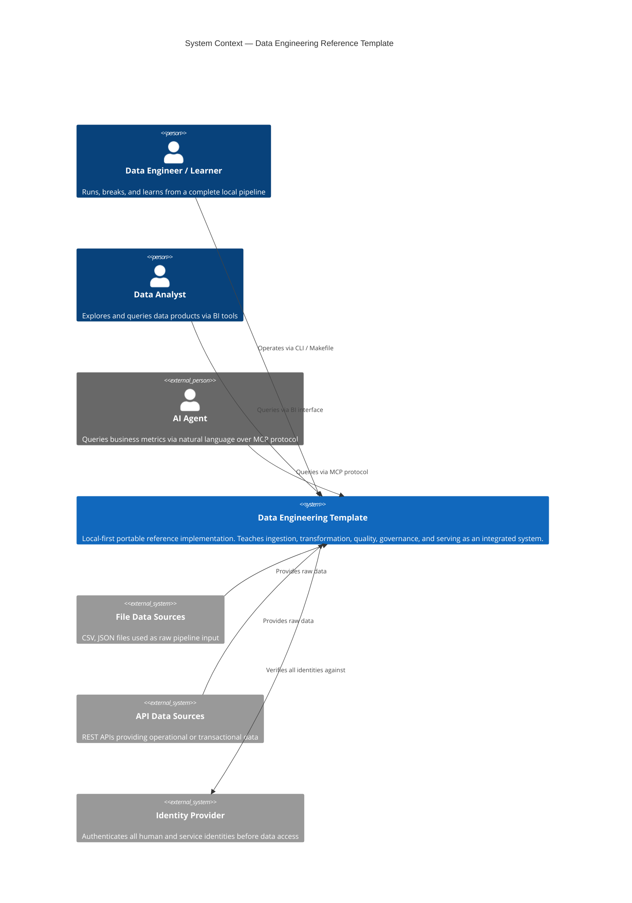
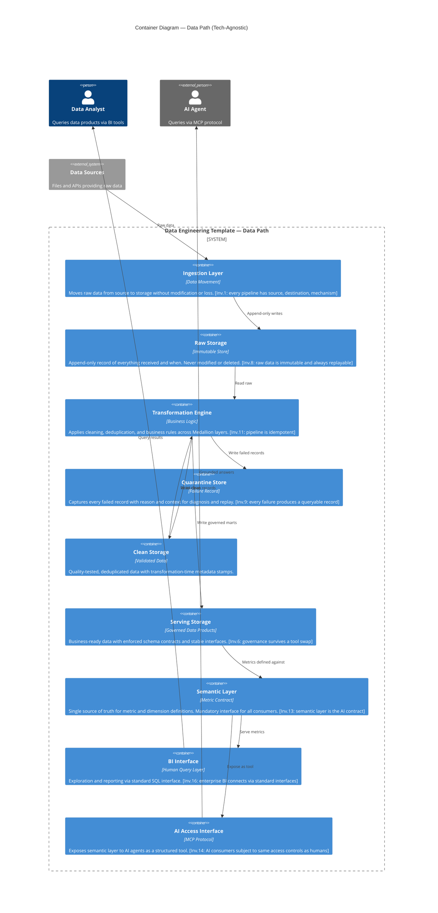
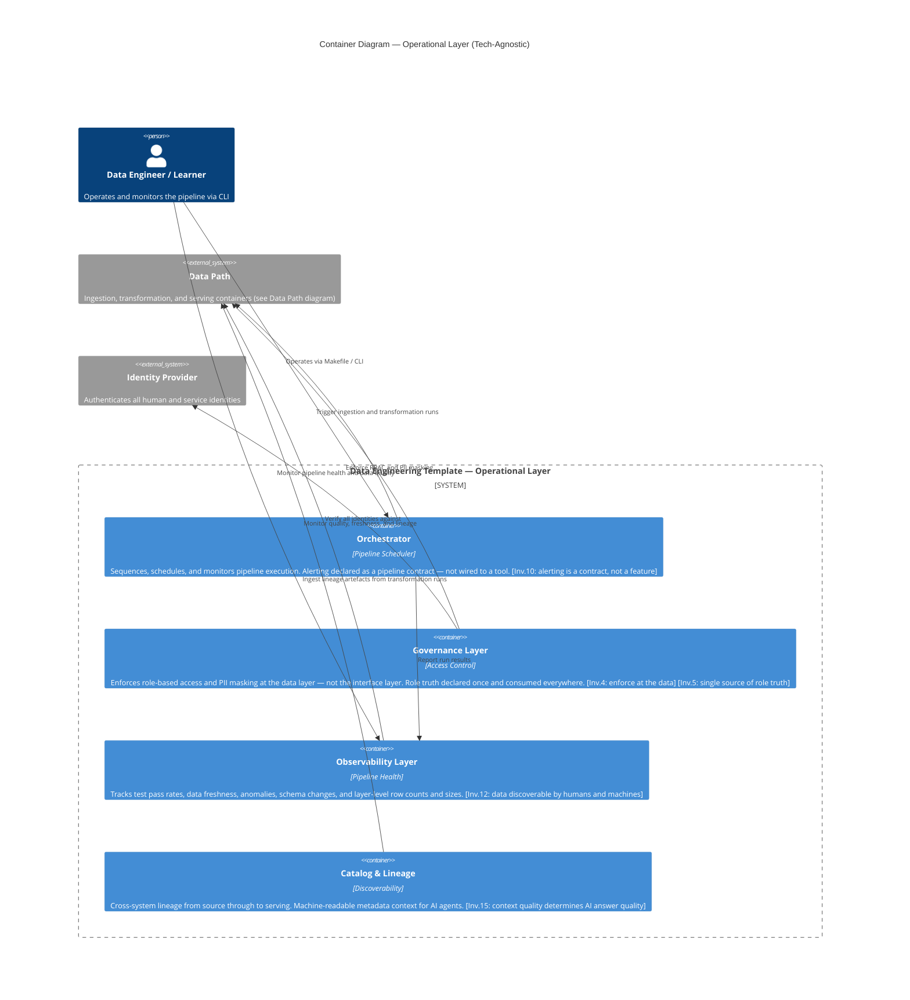
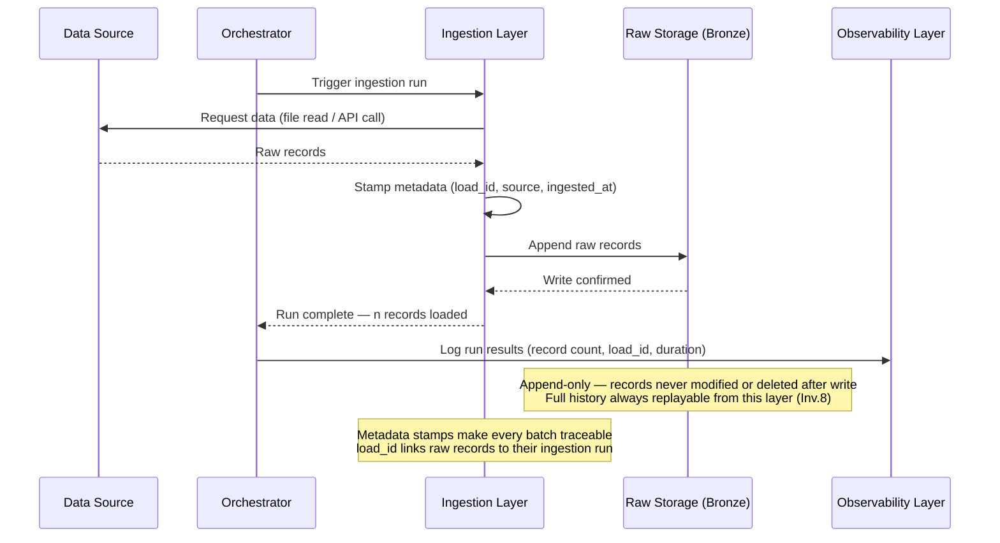
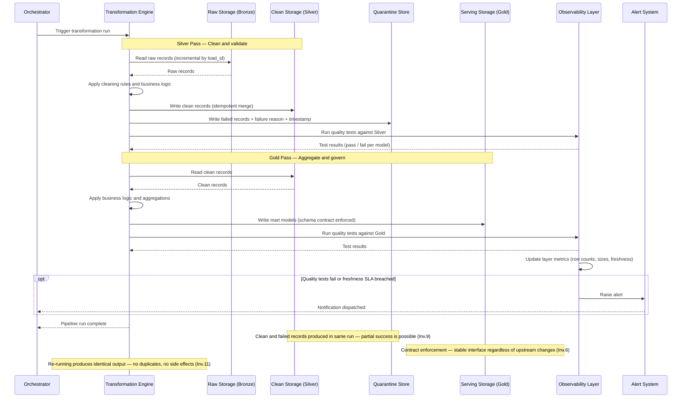
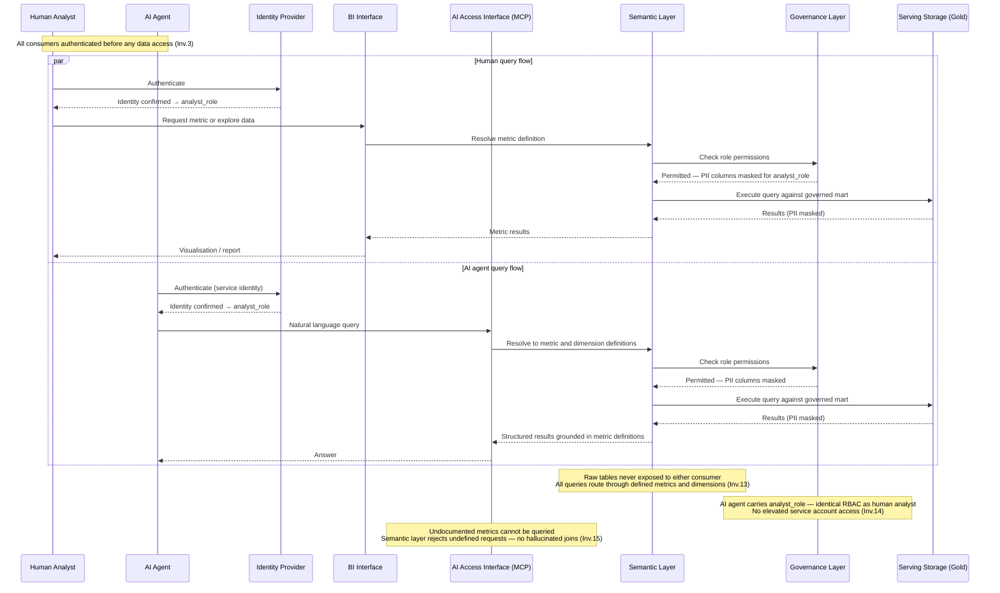
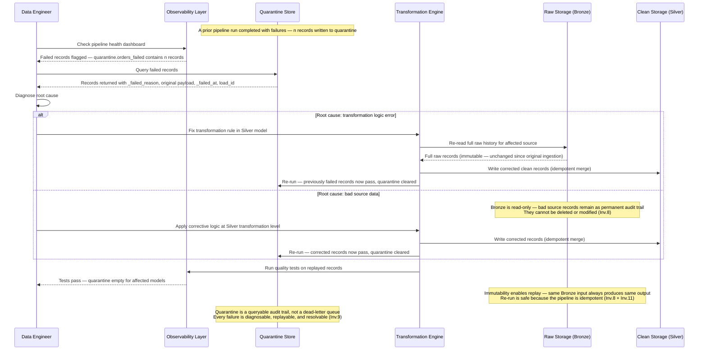

# Architecture Diagrams — test-data-product

**Date:** 2026-03-25
**Status:** Reference — input to implementation phase

---

## About These Diagrams

These diagrams represent the **target architecture** of the data engineering template in a technology-agnostic form. They are intended as implementation guidance — describing *what each component must do* rather than *which tool does it*. The specific tools (DuckDB, Postgres, Trino, Airflow, dlt, etc.) are deployment decisions that vary by profile; the architectural roles shown here remain constant across all profiles.

### How to Read the Invariant Labels

Each component is annotated with one or more **architectural invariants** — the durable principles that survive any tool change. These emerged from the project's First Principles analysis and are referenced throughout the architecture document. Format: `[Inv.N: short description]`.

The full set of 16 invariants is documented in `_bmad-output/brainstorming/brainstorming-session-2026-03-24-1200.md`.

### Diagram Set

| # | Diagram | Type | Shows |
|---|---|---|---|
| 1 | System Context | C4-L1 | External actors and the system boundary |
| 2a | Data Path | C4-L2 | Core data flow components and their invariant roles |
| 2b | Operational Layer | C4-L2 | Orchestration, governance, observability, and lineage |
| 3 | Ingestion Flow | Sequence | Raw data moving from source to immutable storage |
| 4 | Transformation Flow | Sequence | Bronze → Silver → Gold with quality gates and quarantine |
| 5 | Query Flow | Sequence | Human analyst and AI agent consuming data via semantic layer |
| 6 | Error & Replay Flow | Sequence | Diagnosing failures in quarantine and replaying corrected records |

---

## Diagram 1 — System Context (C4 Level 1)

Shows the system and the external actors that interact with it. At this level, the internal structure is a black box.

---

## Diagram 2a — Data Path (C4 Level 2)

The core data flow — from raw source data through to governed, served data products. Components are named by their architectural role. The specific storage engine or transformation tool is a deployment detail that varies by profile; the responsibilities shown here are invariant.

---

## Diagram 2b — Operational Layer (C4 Level 2)

The cross-cutting operational concerns — orchestration, governance, observability, and lineage. These components wrap and support the data path without sitting in it. Shown separately to avoid diagram clutter and because their implementation scope varies significantly by deployment profile.

---

## Diagram 3 — Ingestion Flow (Sequence)

How raw data moves from its source into immutable storage. The ingestion layer is responsible for transport and metadata stamping only — no transformation, no filtering, no business logic.

---

## Diagram 4 — Transformation Flow (Sequence)

How raw data is promoted through the Medallion layers. The transformation engine runs in two passes — Bronze → Silver (clean and validate), then Silver → Gold (aggregate and govern). Quality gates operate at each layer boundary.

---

## Diagram 5 — Query Flow (Sequence)

How human analysts and AI agents consume data. Both routes pass through the semantic layer and are subject to identical role-based access controls — raw tables are never exposed directly to either consumer type.

---

## Diagram 6 — Error & Replay Flow (Sequence)

What happens when records fail transformation. The quarantine store makes failures a first-class, queryable output rather than a silent discard. The immutability of raw storage means replay is always safe — the same Bronze input always produces the same output.

---

*Generated: 2026-03-25 | Source: `_bmad-output/planning-artifacts/architecture.md`*
